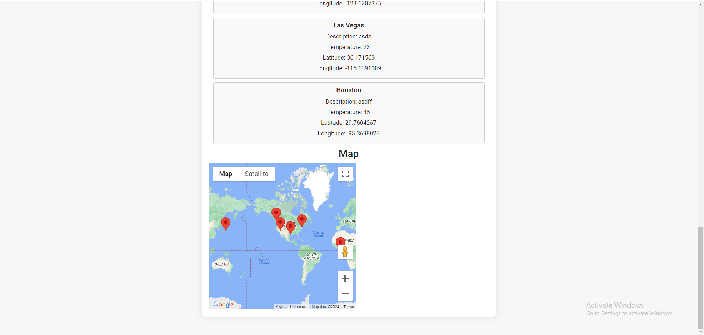

# travel-log

## Description

The motivation for this project was to create a site where you get to post about your favorite places and locate where they are. Once you enter the website, there is a signup and login function where you enter your username and password before you enter the main page. In the main page, there is a post where you have the ability to type in the location, description and temperature of the place, and once you submit, then there will be a map down below that pinned the coords for the location you entered. You can do that for multiple locations. There is also the function to zoom in and out of the map to look closer at the location. We mainly used the React Google Maps API to handle the map functionality, as well as other functionalities like bootstrap, dom, and stripe.

We conducted this project to demonstrate our knowledge with React as well as understand the intricacies of using APIs and React elements to build a functional full-stack website.

## Installation

Run npm i to install basic dependencies, and do npm run develop to run the program.

## Usage

This is how the website should look like:

## Application Link

## Credits

- William Tsai (github.com/1ncarnat10n), https://github.com/1ncarnat10n
- Jandrei Tim (github.com/Jdrei01), https://github.com/Jdrei01
- Tavonn (github.com/TavonnS), https://github.com/TavonnS
- Majd Hamdallah (github.com/Majdhamdallah4), https://github.com/Majdhamdallah4
- Kahlil Bausley (github.com/kahlilbausley), https://github.com/kahlilbausley
- Denise Vasquez (github.com/deemonroee), https://github.com/deemonroee
